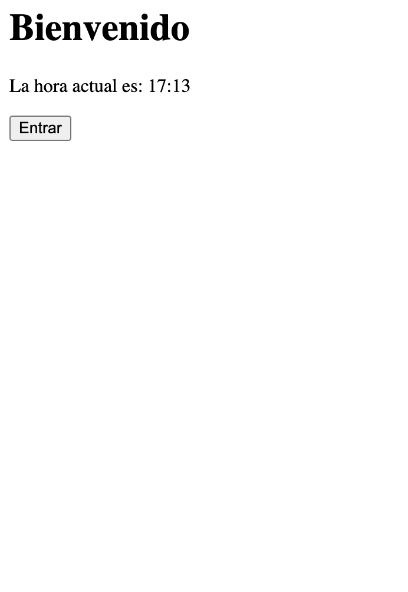
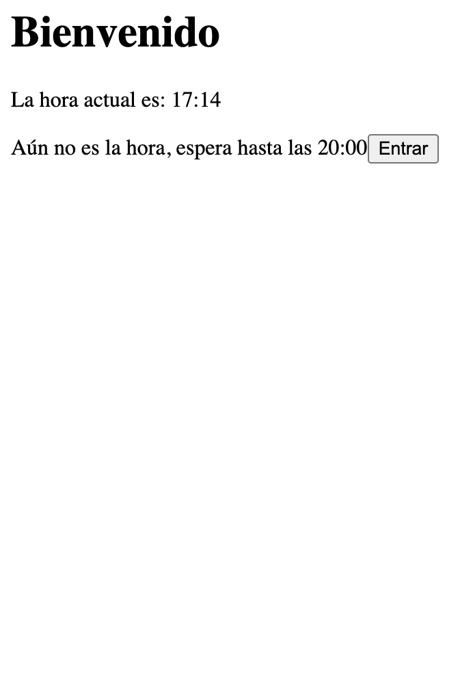

# Ejercicio Express y Middlewares

Este ejercicio utiliza [Express](https://expressjs.com/) para construir un servidor web simple con dos rutas y middleware para obtener la hora actual y validar si la hora es correcta y poder entrar en una ruta específica.

Lee todo bien antes de empezar y así entender lo que se pide.

## Requisitos

Asegúrate de tener [Node.js](https://nodejs.org/) instalado en tu sistema.

## Pasos para ejecutar el código

`npm install`: Con esto instalaremos las dependecia de express

📂 Estructura del Código

📄 app.js: Contiene el código principal de la aplicación con la configuración de Express, middleware y rutas.
📂 middlewares: Carpeta que contiene los middlewares para obtener la hora actual y la validación.
  📄 horaMiddleware.js: Middleware para obtener la hora actual.
  📄 validarHora.js: Módulo que contiene la lógica de validación de la hora.
📂 routes: Carpeta que contiene los módulos de rutas.
  📄 endroute.js: Módulo de ruta para la página final.
  📄 index.js: Módulo de ruta para la página principal.

## Preparando la Aplicación:

1. La primera ruta que debe salir nada más inicializar el servidor será `index.js`
En esta ruta habrá lo siguiente:
- Un texto de bienvenida y la hora actual
- Un botón que enlace `/endroute`
- Al clickar tendrá que validar con el middleware `validarHora.js`si la hora es correcta para poder continuar. Solo se podrá acceder a `/endroute` si la hora es está entre las 12h de la mañana y las 24h.
- Si es antes de las 12 al clickar en el botón nos saldrá un mensaje que diga algo como "Aún no son las 12 de la mañana"
- Si accedemos directamente a la ruta `/endroute`, nos devolverá el mismo error y misma ruta que si pulsaramos el botón 

2. Middlewares
- `horaMiddleware.js`: De aquí sacaremos la hora. Recuerda que hay que pasarla como una req y con js podemos obtener la fecha con new Date()
- `validarHora.js`: Aquí estará la lógica de si accedemos a la siguiente ruta

3. Cuando consigamos superar el middleware haremos lo siguiente
- Llegaremos a la ruta `/endroute` y el `endroute.js` tendrá el siguiente contenido: 
Un texto dando la bienvenida y la ruta donde estamos

Adjunto unas imagenes para poder entenderlo mejor:
* index.js

)

* Dentro de endrpoute.js

* Error de horario

* WARNING!: Aunque pongan las 20:00 es solo un ejemplo. Tú debes hacerlo como dice el ejercicio. Prueba diferentes horas para ver que funciona correctamente

## Pistas:

- Esto podría ser los ejemplos de rutas desde app.js:
* app.use('/endroute', endrouteRouter);
* app.use('/', indexRouter);

- Recuerda que la ruta la estamos trabajando desde app.js. Dentro de cada ruta debe empezar su ruta '/', si repitieramos dentro el resultado podría ser algo similar a esto como URL: /endroute/endroute. Presta mucha atención a las rutas y las URLs.

- Dentro de la `validarHora.js` donde `res.redirect` podría tener un aspecto similar a esto cuando se intente acceder a `/endroute`y aún no sea la hora:
- Que no se te olvide `express.Router()` para generar las rutas
  
  res.locals.mensaje = `Aún no es la hora, espera hasta las 14:00 para entrar`;
  return res.redirect('/?mensaje=' + encodeURIComponent(res.locals.mensaje));

## Y por último...
Está creado `npm start` con '--watch app.js' para poder inicializar el servidor (una vez lo tengas creado en `app.js`)